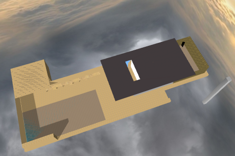
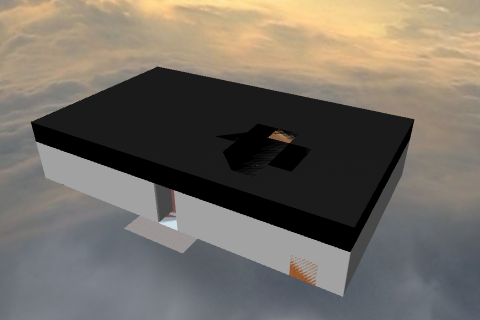

[View 3D Warehouse Files]( ./index.html )
===
[vA3C Hackette view]( http://va3c.github.io/3d-warehouse-samples/ "View files with vA3C Hacker" )
[GitHub view]( https://github.com/va3c/3d-warehouse-samples "View files with GitHub")
[vA3C Hacker Home]( http://va3c.github.io/viewer/va3c-hacker/latest/ )

Five residences/pavilions that in forty years transformed architecture from the decorative to minimalism.

3D Warehouse has many great 3D models and many models of great building. But finding great buildings that also have great models is not easy.

  
[Robie House]( #./robie-house/untitled/robie-house.js#px=-100#sx=200#sy=200#sz=200#add=true ) 1909 - slow but worth it  
[3D Warehouse]( https://3dwarehouse.sketchup.com/model.html?id=e36106e91e880993e3e6a4ac957e86ce ) [GitHub]( https://github.com/va3c/3d-warehouse-samples/tree/gh-pages/robie-house )

  
[Schroder House]( #./schroder-house/untitled/schroder-house.js#sx=5#sy=5#sz=5#add=true ) 1919  
[3D Warehouse]( https://3dwarehouse.sketchup.com/model.html?id=b14447590f4b5e613232617f0a5b3a63 ) [GitHub]( https://github.com/va3c/3d-warehouse-samples/tree/gh-pages/schroder-house )

  
[Villa Savoye]( #./villa-savoye/images/villa-savoye.js#sx=5#sy=5#sz=5#add=true ) 1929  
[3D Warehouse]( https://3dwarehouse.sketchup.com/model.html?id=e2bb07de7a82c468f9c1628d84b1ea48 ) [GitHub]( https://github.com/va3c/3d-warehouse-samples/tree/gh-pages/villa-savoye )

  
[Barcelona Pavilion]( #./barcelona-pavilion/untitled/barcelona-pavilion.js#sx=5#sy=5#sz=5#add=true ) 1930  
[3D Warehouse]( https://3dwarehouse.sketchup.com/model.html?id=a7767394dd9c5f1ab6de6574321e6f11 ) [GitHub]( https://github.com/va3c/3d-warehouse-samples/tree/gh-pages/barcelona-pavilion )

  
[Glass House]( #./glass-house/untitled/glass-house.js#sx=10#sy=10#sz=10#add=true ) 1949   
[3D Warehouse]( https://3dwarehouse.sketchup.com/model.html?id=fcac425aab052f98a5ee547d707fbcab ) [GitHub]( https://github.com/va3c/3d-warehouse-samples/tree/gh-pages/glass-house )

The above images and the underlying 3D models are all part of a first pass at importing files from the 3D Warehouse.
This work is very much a work in progress still at an early stage.

Most of the models need further editing in order to be brought in more successfully.

The long term intention is to be able to link directly to files in the 3D Warehouse.
Clicking the link would cause the file to be downloaded to local storage, unzipped and displayed in 3D using Three.js.   

